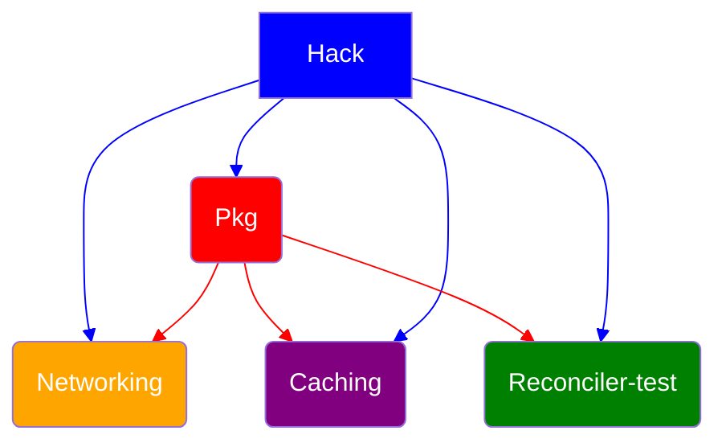
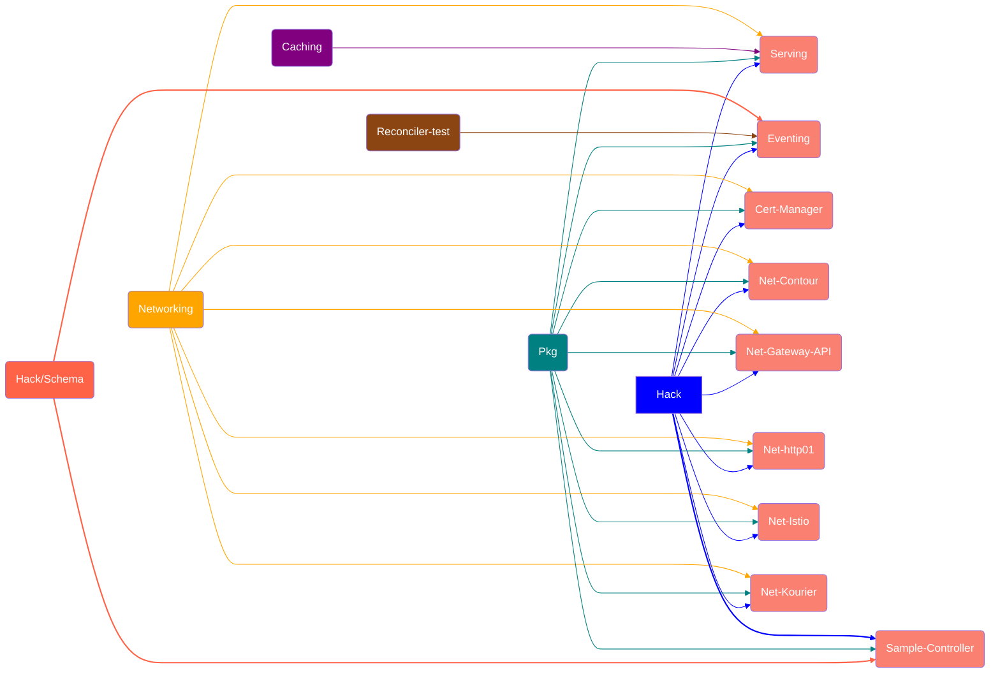

# Procedures

## Supporting Repos

| Repo                                                                                |
| ----------------------------------------------------------------------------------- |
| [knative.dev/hack](https://github.com/knative/hack)                                 |
| [knative.dev/pkg](https://github.com/knative/pkg)                                   |
| [knative.dev/networking](https://github.com/knative/networking)                     |
| [knative.dev/caching](https://github.com/knative/caching)                           |
| [knative.dev/reconciler-test](https://github.com/knative-extensions/reconciler-test)   |
| [knative.dev/control-protocol](https://github.com/knative-extensions/control-protocol) |

## Releasing a repository

To release a `knative.dev` repository, these are the steps needed, in order:

- ✅ [open PR check](#open-pr-check)
- ✅ [build health check](#build-health-check)
- ✅ [dependency check](#dependency-check)
- ✅ [releasability check](#releasability-check)
- ✅ [cut a branch](#cut-a-branch)
- ✅ [automation check](#release-automation-check)
- ✅ [release notes update](#release-notes-update)
- ✅ [homebrew updates](#homebrew-updates)
- ✅ [administrative work](#administrative-work)

Most of the above steps are automated. In some noted exceptions, it might be
necessary to perform some of them manually.

For some repos, there might also be additional validations, or steps that need to be skipped. These exceptions are documented where they apply.

## Open PR check

Please ensure that there are no outstanding PRs for each repo before proceeding with each of the steps. For additional PRs merged into a repo during the release process, new checks need to be done in that repo and in the repos that depend on it.

Since eventing has a couple of different repositories, you can use the following script to create a Github search query for open PRs in the eventing repos from the `knative-automation` or `knative-prow-robot` users:

```bash
$ for org in knative knative-extensions; do for repo in $(curl -s https://api.github.com/orgs/${org}/repos\?per_page\=100 | jq -r '.[] | select(.archived == false) | .full_name' | grep eventing); do echo repo:$repo; done; done | tr '\n' ' '| cat - <(echo "repo:knative-extensions/reconciler-test repo:knative-extensions/sample-source repo:knative-extensions/sample-controller is:open is:pr archived:false author:knative-automation author:knative-prow-robot")

repo:knative/eventing repo:knative-extensions/eventing-kafka repo:knative-extensions/eventing-rabbitmq repo:knative-extensions/eventing-kafka-broker repo:knative-extensions/eventing-autoscaler-keda repo:knative-extensions/eventing-github repo:knative-extensions/eventing-prometheus repo:knative-extensions/eventing-couchdb repo:knative-extensions/eventing-gitlab repo:knative-extensions/eventing-natss repo:knative-extensions/eventing-awssqs repo:knative-extensions/eventing-ceph repo:knative-extensions/eventing-redis repo:knative-extensions/eventing-kogito repo:knative-extensions/eventing-istio repo:knative-extensions/reconciler-test repo:knative-extensions/sample-source repo:knative-extensions/sample-controller is:open is:pr archived:false author:knative-automation author:knative-prow-robot
```
The resulting query can then be used on https://github.com/search.

## Build health check

tl;dr: check that all builds on `main` are passing.

Check if the repository is in a good shape and the builds pass consistently. **This is required** because the [Prow job](#release-job) that builds the release artifacts will execute all the various tests (build, unit, e2e) and, if something goes wrong, the release process will probably need to restart from the beginning.

For any problems in a specific repo, get in touch with the [relevant WG leads](https://github.com/knative/community/blob/main/working-groups/WORKING-GROUPS.md#working-groups) leads to fix them.

## Dependency check

tl;dr: check that all the dependencies for the repo are up-to-date and aligned with the release version.

### Exceptions

Repos that don't have dependencies naturally don't need a dependency check and this step can be skipped for those. Currently, `knative.dev/hack` is the only `knative.dev` repo that does not have any dependencies.

### Aligning dependencies

Each repo needs to be successfully updated to use the latest version of all shared dependencies **before** its release branch is cut.Refer **[Supporting Repo Dependencies](PROCEDURES.md/#supporting-repo-dependencies)** and **[Core Repo Dependencies](PROCEDURES.md/#Core-repo-dependencies)**.

In order to align the `knative.dev` dependencies, `knative-extensions/knobots` automation will run "Upgrade to latest dependencies PRs ([example](https://github.com/knative/eventing/pull/4713)) for each repo, executing the command `./hack/update-deps.sh --upgrade --release 0.20` and committing all the content. Note: `buoy check`, which is invoked in the script, will fail if the dependencies are not yet ready.

- If there is no "Upgrade to latest dependencies" PR open, the update PR might already have been merged. If this is not the case, manually trigger the generation of this PR starting the [Knobots Auto Update Deps](https://github.com/knative-extensions/knobots/actions/workflows/auto-update-deps.yaml) and wait for the PR to pop in the repo you need. Note that in the automation run you have to change the field `If true, send update PRs even for deps changes that don't change vendor. Use this only for releases.` to **true**, because in some cases there are no code changes in the vendor.
- Check the `go.mod` to ensure hashes point to commit hash at the head of the release branch of the dependency repo
  - For the **[supporting repos](PROCEDURES.md#supporting-repos)** repos (`hack`, `pkg`, etc) you should see the dependency version pointing at a revision which should match the `HEAD` of the release branch. E.g. `knative.dev/pkg v0.0.0-20210112143930-acbf2af596cf` points at the revision `acbf2af596cf`, which is the `HEAD` of the `release-0.20` branch in `pkg` repo.
  - For the **core release** repos, you should see the dependency version pointing at the version tag. E.g. `knative.dev/eventing v0.20.0` points at the tag `v0.20.0` in the `eventing` repo.

## Releasability check

tl;dr: check that the releasability test is passing. If there is any failure, check if the correct SHA is updated in the required repo.

### Exceptions

Repos that don't have dependencies naturally don't need a releasability check and this step can be skipped for those. Currently, `knative.dev/hack` is the only `knative.dev` repo that does not have any dependencies.

The releasability check will not work on dot releases and there is a potential for false positives in those cases.

### Updating the releasability defaults

Open a PR in the `knative/release` repo to update the releasability defaults for a release. This can be found in the [releasability worfklow](https://github.com/knative/release/blob/main/.github/workflows/releasability.yaml#L24)

### Verifying releasability

An automatic releasability workflow is executed periodically and the results are posted on the corresponding Slack release channel. If the dependencies are properly aligned, the releasability test will pass.

A test can be re-run by manually running the [Releasability workflow](https://github.com/knative/release/actions).

If the releasability test reports a NO-GO on a repo where it was previously passing, probably a new PR merge introduced a dependency misalignment. Whatever the reason, if the releasability test is failing, it is necessary to start with the first step in the [Releasing a repository](#releasing-a-repository) process to get this test to a passing state.

## Cut a branch

tl;dr: cut a release branch from `main`.

### Cutting a branch

Cutting a `release-x.y` branch can be done by using the GitHub UI:

1. Click on the branch selection box at the top level page of the repository.

   - 

2. Search for the correct `release-x.y` branch name for the release.

   - 

3. Click "Create branch: release-x.y".

   - 

Otherwise, you can do it by hand on your local machine.

### What could go wrong?

In case you cut a branch before it was ready (e.g. some deps misalignment, a failing test, etc), then follow the steps below:

1. Mark the broken release as a `pre-release`
1. Create a dot release by waiting until the job triggers (once a week on Tue) or [on demand](https://github.com/knative/test-infra/blob/main/guides/manual_release.md#creating-a-dot-release-on-demand).
1. Repeat the steps for a release for the new dot release

## Release automation check

tl;dr: check that the release job succeeded.

The automation used to cut the actual releases is the very same as the automation used to cut nightly releases. The only difference is that the nightly job runs on `main`, and the release job runs against the release branch.

### Exceptions

Repos that don't require release artifacts (such as release tags and GitHub release for example) naturally don't need a release automation check and this step can be skipped for those. All of the [supporting repos](PROCEDURES.md#supporting-repos) fit these criteria.

### Nightly job

tl;dr: verify the nightly release automation is passing.

Verify via [testgrid](http://testgrid.knative.dev) that all relevant nightly releases are passing ([example](http://testgrid.knative.dev/serving#nightly)). If they are not, coordinate with the relevant WG leads to fix them.

### Release job

tl;dr: verify the release automation succeeded.

After a `release-x.y` branch comes into existence, a Prow job builds the code
from that branch, creates a release tag in the repo, publishes the images, publishes the `yaml` artifacts, and generates the GitHub release for that repo. It takes about 2hrs for this job to complete.

Verify the release automation succeeded for all relevant repos via the Prow dashboard: [Prow Status for the release automation - all repos](https://prow.knative.dev/?job=release*).

### Manually triggering a release

You can manually trigger a release for a repository by re-running its release job.

1. Navigate to https://prow.knative.dev/

   

2. Search for the `release*` job for the repository.

   

3. Rerun the release job.

   

## Release notes

### Exceptions

Repos that don't require release artifacts (such as release tags and GitHub release for example) naturally don't need a release note and this step can be skipped for those. All of the [supporting repos](PROCEDURES.md#supporting-repos) fit these criteria.

To create release note for each repo, run the [Release Notes workflow](https://github.com/knative/release/actions/workflows/release-note.yaml). Afterwards the release note markdown will be a downloadable artifact.

## Releasing a new version of the Knative documentation

To release a new version of the docs you must:

1. [Check dependencies](#check-dependencies)
1. [Create a release branch](#create-a-release-branch)
1. [Generate the new docs version](#generate-the-new-docs-version)

### Check dependencies

You cannot release a new version of the docs until the Knative components have
built their new release.
This is because the website references these releases in various locations.

Check the following components for the new release:

- [client](https://github.com/knative/client/releases/)
- [eventing](https://github.com/knative/eventing/releases/)
- [operator](https://github.com/knative/operator/releases/)
- [serving](https://github.com/knative/serving/releases/)

### Create a release branch

1. Check on the `#docs` Slack channel to make sure the release is ready.
   _In the future, we should automate this so the check isn't needed._

2. Using the GitHub UI, create a `release-X.Y` branch based on `main`.

   - 

### Generate the new docs version

To generate the new version of the docs, you must update the [`hack/build.sh`](https://github.com/knative/docs/blob/main/hack/build.sh)
script in the main branch to reference the new release.

We keep the last 4 releases available per [our support window](https://github.com/knative/community/blob/main/mechanics/RELEASE-VERSIONING-PRINCIPLES.md#knative-community-support-window-principle).

To generate the new docs version:

1.  In `hack/build.sh` on the main branch, update `VERSIONS`
    to include the new version, and remove the oldest. Order matters, most recent first.

        For example:

        ```
        VERSIONS=("1.10" "1.9" "1.8")
        ```

2.  PR the result to main.

### How GitHub and Netlify are hooked up

Netlify build is configured via [netlify.toml](https://github.com/knative/docs/blob/main/netlify.toml)

## Homebrew updates

### homebrew-client

After the client release, the [Homebrew tap](https://github.com/knative/homebrew-client) needs to be updated with the new release:

- Copy `kn.rb` to the `kn@${PREV_RELEASE}.rb` with `$PREV_RELEASE` to be replace with the latest release (e.g. `0.19`).
- In `kn@${PREV_RELEASE}.rb` replace `class Kn` with `class KnAT${PREV_RELEASE_DIGITS}`, e.g `class KnAT019` for an previous release `0.19`.
- In `kn.rb`:
  - Replace the old version number in `v` with the released version (e.g. `v = "v0.20.0"`)
  - Replace the `sha256` checksums with the values from the [client release page](https://github.com/knative/client/releases). The checksums have been released too (e.g. [checksums.txt](https://github.com/knative/client/releases/download/v0.22.0/checksums.txt))

✅ Open a PR and merge the changes. Prow is not enabled for the homebrew repo, so the merge needs to be performed manually.

## Administrative work

### Permissions for release leads

During a release, the release leads for that cycle need to be given all the permissions to perform the tasks needed for a release. Likewise, permissions for leads from the previous release cycle need to be revoked.

Check if the new leads are included in/removed from these two files in the `Knative Release Leads` section:

- [knative/community/main/peribolos/knative.yaml#Knative Release Leads](https://github.com/knative/community/blob/e635686d46366906af861c409978c2c55990a10e/peribolos/knative.yaml#L878)
- [knative/community/main/peribolos/knative-extensions.yaml#Knative Release Leads](https://github.com/knative/community/blob/e635686d46366906af861c409978c2c55990a10e/peribolos/knative-extensions.yaml#L739)

If not, open a PR in the `knative/community` repo to grant/remove permissions. Here's an example:

- [update release leads for 1.5 by nader-ziada · Pull Request #1021 · knative/community](https://github.com/knative/community/pull/1021?w=1)
- be sure to run `/hack/update-codegen.sh` so leads are added to/removed from the `OWNERS_ALIASES`.

It is ok to add/remove leads in two separate PRs.

### Bump dependencies in auto update job

After a release open a PR in the [knobots repo](https://github.com/knative-extensions/knobots) to bump the [update-deps job](https://github.com/knative-extensions/knobots/actions/workflows/auto-update-deps.yaml) to the next release version. See [here](https://github.com/knative-extensions/knobots/pull/216) for an example.

### Updating the release schedule

We maintain a list of current (and future) releases in the [Community repo](https://github.com/knative/community/blob/main/mechanics/RELEASE-SCHEDULE.md). When a new release goes out, an older one will almost always fall out of support. We should update the release schedule accordingly by opening a PR against the community repo. See [here](https://github.com/knative/community/pull/991/files) for an example.

## Supporting Repo Dependencies



## Core Repo Dependencies


