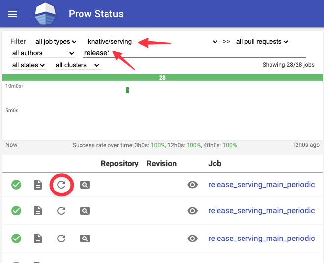

# Knative Release

This document includes the roster, instructions and timetable to perform a
Knative release.

For each release cycle, we dedicate a team of two individuals, one from Eventing
and one from Serving, to shepherd the release process. Participation is
voluntary and based on good faith. We are only expected to participate during
our local office hour.

---

# Roster

We seed this rotation with all approvers from all the Serving and Eventing
workgroups, excluding productivity. If you are no longer active in Knative, or
if you are contributing on personal capacity and do not have time to contribute
in the rotation, feel free to send a PR to remove yourself.

## Serving

This roster is seeded with all approvers from Serving workgroups, plus additional volunteers.

- dprotaso
- julz
- nak3
- psschwei
- yanweiguo
- ZhiminXiang

## Eventing

This roster is seeded with all approvers from Eventing workgroups, plus additional volunteers.

- evankanderson
- lionelvillard
- matzew
- bmo

## Client roster

This roster is seeded with approvers from the Client workgroups.

- dsimansk
- rhuss

## Schedule

| Release | Release Date | Serving        | Eventing            | PKG cut    | Unpin repos
| ------- | ------------ | -------------- | --------------------| ---------- | -----------
| v0.17   | 2020-08-18   | yanweiguo      | Harwayne            | 2020-08-11 | 2020-08-19
| v0.18   | 2020-09-29   | ZhiminXiang    | n3wscott            | 2020-09-22 | 2020-09-30
| v0.19   | 2020-11-10   | julz           | n3wscott            | 2020-11-03 | 2020-11-11
| v0.20   | 2021-01-12   | nak3           | slinkydeveloper     | 2021-01-07 | 2021-01-13
| v0.21   | 2021-02-23   | mattmoor       | lionelvillard       | 2021-02-16 | 2021-02-24
| v0.22   | 2021-04-06   | markusthoemmes | evankanderson       | 2021-03-30 | 2021-04-07
| v0.23   | 2021-05-18   | tcnghia        | vaikas              | 2021-05-11 | 2021-05-19
| v0.24   | 2021-06-29   | dprotaso       | matzew              | 2021-06-22 | 2021-06-30
| v0.25   | 2021-08-10   | yanweiguo      | lionelvillard       | 2021-08-03 | 2021-08-11
| v0.26   | 2021-09-21   | ZhiminXiang    | evankanderson       | 2021-09-14 | 2021-09-22
| v1.0    | 2021-11-02   | julz           | bmo                 | 2021-10-26 | 2021-11-03
| v1.1    | 2021-12-14   | nak3           | matzew              | 2021-12-07 | 2021-12-15
| v1.2    | 2022-01-25   | dprotaso       | psschwei            | 2022-01-18 | 2022-01-26
| v1.3    | 2022-03-08   |                | xtreme-sameer-vohra | 2022-03-01 | 2022-03-09

---

# Instructions

Below you'll find the instructions to release a `knative.dev` repository.

For more information on the timetable, jump to the [Timetable](#timetable)
paragraph.

## Release a repository

Releasing a repository includes:

- Aligning the `knative.dev` dependencies to the other release versions on
  main (except hack, which has no dependencies)
- For some repositories some additional validation need to be performed before a release can be cut. Check [special repository checks](#special-repository-actions) for which repository extra steps needs to be performed.
- Creating a new branch starting from main for the release (e.g.
  `release-0.20`)
- Execute the job on Prow that builds the code from the release branch, tags the
  revision, publishes the images, publishes the yaml artifacts and generates the
  Github release.

Most of the above steps are automated, although in some situations it might be
necessary to perform some of them manually.

### Check the build on main passes

Before beginning, check if the repository is in a good shape and the builds pass
consistently. **This is required** because the Prow job that builds the release
artifacts will execute all the various tests (build, unit, e2e) and, if
something goes wrong, you will probably need to restart this process from the
beginning.

For any problems in a specific repo, get in touch with the relevant WG leads to
fix them.

### Aligning the dependencies

In order to align the `knative.dev` dependencies, knobots will perform PRs like
[this](https://github.com/knative/eventing/pull/4713) for each repo, executing
the command `./hack/update-deps.sh --upgrade --release 0.20` and committing all
the content.

If no dependency bump PR is available, you can either:

- Manually trigger the generation of these PRs starting the
  [Knobots Auto Update Deps](https://github.com/knative-sandbox/knobots/actions/workflows/auto-update-deps.yaml)
  and wait for the PR to pop in the repo you need. Note you have to change the
  field `If true, send update PRs even for deps changes that don't change vendor. Use this only for releases.`
  to true, because in some cases there no code changes in the vendor.
- Execute the script below on your machine:

```shell
RELEASE=0.20
REPO=git@github.com:knative/example.git

tmpdir=$(dirname $(mktemp -u))
cd ${tmpdir}
git clone ${REPO}
cd "$(basename "${REPO}" .git)"

./hack/update-deps.sh --upgrade --release ${RELEASE}
./hack/update-codegen.sh

# If there are no changes, you can go to the next step without committing any change.
# Otherwise, commit all the changes
git status
```
- Commit the changes and send a PR against the `main` branch. Before doing so, check whether some additional, manual updates are required, that you can also add to this PR (to save some roundtrips). Section [Special repository actions](#special-repository-actions) contains the repository specific instructions (if any).

### Special repository actions

For some repositories some extra manual validation and updates need to be performed before the release branch is cut:

#### knative/client

* Update the version numbers of Serving and Eventing in [test/presubmit-integration-tests-latest-release.sh](https://github.com/knative/client/blob/main/test/presubmit-integration-tests-latest-release.sh#L20-L21) so that the integration test is already running against the just released serving and eventing versions.
* (optional) Check that [CHANGELOG.adoc](https://github.com/knative/client/blob/main/CHANGELOG.adoc) contains a section about the release, i.e. the top-level "(Unreleased)" section should be changed to point to the upcoming release version and number. It's not critical if the changelog is aligned after the release in retrospective.

If the validation fails, the fix should be trivial and could be either performed by the release leads or the client team.

#### knative-sandbox/kn-plugin-quickstart

* Update the version numbers of Serving / Kourier / Eventing in [pkg/install/install.go](https://github.com/knative-sandbox/kn-plugin-quickstart/blob/main/pkg/install/install.go#L25-L27) so that the plugin will use the just-released versions.

### Releasability

At this point, you can proceed with the releasability check. A releasability
check is executed periodically and posts the result on the Slack release channel
and it fails if the dependencies are not properly aligned. If you don't want to
wait, you can manually execute the
[Releasability workflow](https://github.com/knative/serving/actions?query=workflow%3AReleasability).

If the releasability reports NO-GO, probably there is some deps misalignment,
hence you need to go back to the previous step and check the dependencies,
otherwise, you're ready to proceed.

You can execute the releasability check locally using
[**buoy**](https://github.com/knative/test-infra/tree/main/buoy):

```bash
RELEASE=0.20
REPO=git@github.com:knative/example.git

tmpdir=$(dirname $(mktemp -u))
cd ${tmpdir}
git clone ${REPO}
cd "$(basename "${REPO}" .git)"

if buoy check go.mod --domain knative.dev --release ${RELEASE} --verbose; then
  git checkout -b release-${RELEASE}
  ./hack/update-deps.sh --upgrade --release ${RELEASE}
  git status
fi
```

If there are changes, then it's NO-GO, otherwise it's GO

### Just one last check before cutting

After the dependencies are aligned and releasability is ready to GO, perform one
last check manually that every `knative.dev` in the `go.mod` file is properly
configured:

- For the _support_ repos (`hack`, `test-infra`, `pkg`, etc) you should see the
  dependency version pointing at a revision which should match the `HEAD` of the
  release branch. E.g. `knative.dev/pkg v0.0.0-20210112143930-acbf2af596cf`
  points at the revision `acbf2af596cf`, which is the `HEAD` of the
  `release-0.20` branch in `pkg` repo.
- For the _release_ repos, you should see the dependency version pointing at the
  version tag. E.g. `knative.dev/eventing v0.20.0` points at the tag `v0.20.0`
  in the `eventing` repo.

### Cut the branch

Now you're ready to create the `release-x.y` branch. This can be done by using
the GitHub UI:

1. Click on the branch selection box at the top level page of the repository.

   

1. Search for the correct `release-x.y` branch name for the release.

   

1. Click "Create branch: release-x.y".

   

Otherwise, you can do it by hand on your local machine.

### The Prow job

After a `release-x.y` branch exists, a 4 hourly prow job will build the code
from the release branch, tag the revision, publish the images, publish the yaml
artifacts and generate the Github release. Update the description of the release
with the release notes collected.

You can manually trigger the release:

1. Navigate to https://prow.knative.dev/

   

1. Search for the `*-auto-release` job for the repository.

   

1. Rerun the auto-release job.

   

### Verify nightly release automation is intact

The automation used to cut the actual releases is the very same as the
automation used to cut nightly releases. Verify via testgrid that all relevant
nightly releases are passing. If they are not coordinate with the relevant WG
leads to fix them.

### What could go wrong?

In case you cut a branch before it was ready (e.g. some deps misalignment, a
failing test, etc), you can try to restart this process. But first, clean up the
repo in this order:

1. Remove the Github release (if any)
1. Remove the git tag (if any) using `git push --delete origin v0.20.0`
   (assuming `origin` is the `knative.dev` repo)
1. Remove the git branch (if any) from the Github UI


---

# Timetable

We release the components of Knative every 6 weeks. All of these components must
be moved to the latest "release" of all shared dependencies prior to each
release.

## First week of the rotation

### Make sure you have the right permission

Check to make sure you already are in the "Knative Release Leads" team in
https://github.com/knative/community/blob/main/peribolos/knative.yaml and
https://github.com/knative/community/blob/main/peribolos/knative-sandbox.yaml
. If not, send a PR like
[this one](https://github.com/knative/community/pull/209) to grant yourself some
super power.

### Create a release Slack channel

Ask someone from the TOC to create a **release-`#`** Slack channel that will be
used to help manage this release.

## 14 days prior to the release

### Update the Knative releasability defaults

Update the defaults in
[knative-releasability.yaml](https://github.com/knative-sandbox/.github/blob/1e4e31edfb2181220db744ad0fcb135629e1cb8e/workflow-templates/knative-releasability.yaml#L37-L41)
to this release [sample PR](https://github.com/knative-sandbox/.github/pull/102).

Notice that you only need to update the file in the [`knative-sandbox`](https://github.com/knative-sandbox/.github/blob/main/workflow-templates/knative-releasability.yaml) repository as it is treated as the source of truth and the changes are propagated from there.

These changes will be propagated to the rest of Knative in the next round of
workflow syncs.

### Announce the imminent `pkg` cut

Announce on **#general** that `pkg` will be cut in a week.

## 7 days prior to the release

### Cut release branches of supporting repos

The supporting repos are the base repos where we have common code and common
scripts. For these repos (except **hack**), we follow the same release process as
explained in [release a repository](#release-a-repository), but no prow job is
executed, hence no git tag and Github release are produced.

First repo that needs to be released is **hack**. As mentioned, **hack** is
special because it has no dependencies and hence there's no releasability
checks, just ensure there are no outstanding PRs and
[create a release branch](#cut-the-branch).

- [knative/hack](https://github.com/knative/hack)

After **hack** release branch has been cut, follow the
[release a repository](#release-a-repository) guide for the following repos
skipping the prow job part:

| Repo                                                            | Releasability                                                                             |
| --------------------------------------------------------------- | ----------------------------------------------------------------------------------------- |
| [knative.dev/pkg](https://github.com/knative/pkg)               |         |
| [knative.dev/test-infra](https://github.com/knative/test-infra) |  |

After **pkg** and **test-infra** repos have their release branches cut, follow
the [release a repository](#release-a-repository) guide for the following repos
skipping the prow job part:

| Repo                                                                              | Releasability                                                                                          |
| --------------------------------------------------------------------------------- | ------------------------------------------------------------------------------------------------------ |
| [knative.dev/networking](https://github.com/knative/networking)                   |               |
| [knative.dev/caching](https://github.com/knative/caching)                         |                  |
| [knative.dev/reconciler-test](https://github.com/knative-sandbox/reconciler-test) |  |

After **reconciler-test** repo has been cut, follow the
[release a repository](#release-a-repository) guide for the following repos
skipping the prow job part:

| Repo                                                                                | Releasability                                                                                           |
| ----------------------------------------------------------------------------------- | ------------------------------------------------------------------------------------------------------- |
| [knative.dev/control-protocol](https://github.com/knative-sandbox/control-protocol) |  |

Automation will propagate these updates to all the downstream repos in the next
few cycles. The goal is to have the first wave of repo releases (**serving**,
**eventing**, etc) to become "releasable" by the end of the week. This is
signaled via the Slack report of releasability posted to the **release-`#`**
channel every morning (5am PST, M-F).

### Announce the imminent release cut

Announce on **#general** that the release will be cut in a week and that
additional caution should be used when merging big changes.

### Collect release-notes

Make a new HackMD release notes document.
[last release notes document](https://hackmd.io/cJwvzJ4eRVeqqiXzOPtxsA), empty
it out and send it to the WG leads of the respective project (serving or
eventing) to fill in. Coordinate with both serving and eventing leads.

Each repo has a `Release Notes` GitHub Action workflow. This can be used to
generate the starting point for the release notes. See an example in
[Eventing](https://github.com/knative/eventing/actions?query=workflow%3A%22Release+Notes%22).
The default starting and ending SHAs will work if running out of the `main`
branch, or you can determine the correct starting and ending SHAs for the script
to run.

## 1 day prior to the release

### Confirm readiness

Confirm with the respective WG leads that the release is imminent and obtain
green light.

## Day of the release

Follow the [release a repository](#release-a-repository) instructions for each
repo. Wait for [release automation](#the-prow-job) to kick in (runs on a 2 hour
interval). Once the release automation passed, it will create a release tag in
the repository. Enhance the respective tags with the collected release-notes
using the GitHub UI.

In general the release dependency order is something like the following (as of
v0.20). Note: `buoy check` will fail if the dependencies are not yet ready.

First:

| Repo                                                                                  | Release                                                                                                                                                                   | Releasability                                                                                            | Nightly                                                                                                  |
| ------------------------------------------------------------------------------------- | ------------------------------------------------------------------------------------------------------------------------------------------------------------------------- | -------------------------------------------------------------------------------------------------------- | -------------------------------------------------------------------------------------------------------- |
| [knative.dev/serving](https://github.com/knative/serving)                             | [](https://github.com/knative/serving/releases)                                     |                    |                    |
| [knative.dev/net-certmanager](https://github.com/knative-sandbox/net-certmanager)     | [](https://github.com/knative-sandbox/net-certmanager/releases)     |    |    |
| [knative.dev/net-contour](https://github.com/knative-sandbox/net-contour)             | [](https://github.com/knative-sandbox/net-contour/releases)             |        |        |
| [knative.dev/net-http01](https://github.com/knative-sandbox/net-http01)               | [](https://github.com/knative-sandbox/net-http01/releases)               |         |         |
| [knative.dev/net-istio](https://github.com/knative-sandbox/net-istio)                 | [](https://github.com/knative-sandbox/net-istio/releases)                 |          |          |
| [knative.dev/net-kourier](https://github.com/knative-sandbox/net-kourier)             | [](https://github.com/knative-sandbox/net-kourier/releases)             |        |        |
| [knative.dev/net-gateway-api](https://github.com/knative-sandbox/net-gateway-api)             | [](https://github.com/knative-sandbox/net-gateway-api/releases)             |        |        |
| [knative.dev/eventing](https://github.com/knative/eventing)                           | [](https://github.com/knative/eventing/releases)                                   |                   |                   |
| [knative.dev/sample-controller](https://github.com/knative-sandbox/sample-controller) | [](https://github.com/knative-sandbox/sample-controller/releases) |  |  |

After **eventing**:

| Repo                                                                                          | Release                                                                                                                                                                           | Releasability                                                                                                | Nightly                                                                                                      |
| --------------------------------------------------------------------------------------------- | --------------------------------------------------------------------------------------------------------------------------------------------------------------------------------- | ------------------------------------------------------------------------------------------------------------ | ------------------------------------------------------------------------------------------------------------ |
| [knative.dev/eventing-awssqs](https://github.com/knative-sandbox/eventing-awssqs)             | [](https://github.com/knative-sandbox/eventing-awssqs/releases)             |        |        |
| [knative.dev/eventing-ceph](https://github.com/knative-sandbox/eventing-ceph)                 | [](https://github.com/knative-sandbox/eventing-ceph/releases)                 |          |          |
| [knative.dev/eventing-couchdb](https://github.com/knative-sandbox/eventing-couchdb)           | [](https://github.com/knative-sandbox/eventing-couchdb/releases)           |       |       |
| [knative.dev/eventing-kogito](https://github.com/knative-sandbox/eventing-kogito) | [](https://github.com/knative-sandbox/eventing-kogito/releases) |  |  |
| [knative.dev/eventing-natss](https://github.com/knative-sandbox/eventing-natss)               | [](https://github.com/knative-sandbox/eventing-natss/releases)               |         |         |
| [knative.dev/eventing-prometheus](https://github.com/knative-sandbox/eventing-prometheus)     | [](https://github.com/knative-sandbox/eventing-prometheus/releases)     |    |    |
| [knative.dev/eventing-rabbitmq](https://github.com/knative-sandbox/eventing-rabbitmq)         | [](https://github.com/knative-sandbox/eventing-rabbitmq/releases)         |      |      |
| [knative.dev/sample-source](https://github.com/knative-sandbox/sample-source)                 | [](https://github.com/knative-sandbox/sample-source/releases)                 |          |          |

After both **eventing** and **serving**:

| Repo                                                                              | Release                                                                                                                                                               | Releasability                                                                                          | Nightly                                                                                                |
| --------------------------------------------------------------------------------- | --------------------------------------------------------------------------------------------------------------------------------------------------------------------- | ------------------------------------------------------------------------------------------------------ | ------------------------------------------------------------------------------------------------------ |
| [knative.dev/client](https://github.com/knative/client)     | [](https://github.com/knative/client/releases)     |    |  |
| [knative.dev/eventing-kafka](https://github.com/knative-sandbox/eventing-kafka)               | [](https://github.com/knative-sandbox/eventing-kafka/releases)               |         |         |
| [knative.dev/eventing-redis](https://github.com/knative-sandbox/eventing-redis)   | [](https://github.com/knative-sandbox/eventing-redis/releases)   |   |   |
| [knative.dev/eventing-github](https://github.com/knative-sandbox/eventing-github) | [](https://github.com/knative-sandbox/eventing-github/releases) |  |  |
| [knative.dev/eventing-gitlab](https://github.com/knative-sandbox/eventing-gitlab) | [](https://github.com/knative-sandbox/eventing-gitlab/releases) |  |  |

Lastly:

| Repo                                                                                                | Release                                                                                                                                                                                 | Releasability                                                                                                   | Nightly                                                                                                         |
| --------------------------------------------------------------------------------------------------- | --------------------------------------------------------------------------------------------------------------------------------------------------------------------------------------- | --------------------------------------------------------------------------------------------------------------- | --------------------------------------------------------------------------------------------------------------- |
| [knative.dev/eventing-kafka-broker](https://github.com/knative-sandbox/eventing-kafka-broker) | [](https://github.com/knative-sandbox/eventing-kafka-broker/releases) |  |  |
| [knative.dev/eventing-autoscaler-keda](https://github.com/knative-sandbox/eventing-autoscaler-keda) | [](https://github.com/knative-sandbox/eventing-autoscaler-keda/releases) |  |  |
| [knative.dev/kn-plugin-admin](https://github.com/knative-sandbox/kn-plugin-admin) | [](https://github.com/knative-sandbox/kn-plugin-admin/releases) |  |  |
| [knative.dev/kn-plugin-source-kafka](https://github.com/knative-sandbox/kn-plugin-source-kafka) | [](https://github.com/knative-sandbox/kn-plugin-source-kafka/releases) |  |  |
| [knative.dev/kn-plugin-source-kamelet](https://github.com/knative-sandbox/kn-plugin-source-kamelet) | [](https://github.com/knative-sandbox/kn-plugin-source-kamelet/releases) |  |  |
| [knative.dev/kn-plugin-quickstart](https://github.com/knative-sandbox/kn-plugin-quickstart) | [](https://github.com/knative-sandbox/kn-plugin-quickstart/releases) |  |  |

We have a few repos inside of Knative that are not handled in the standard
process at the moment. They might have additional dependencies or depend on the
releases existing. **Skip these**. Special cases are:

| Repo                                                        | Release                                                                                                                                 | Releasability                                                                           | Nightly                                                                               |
| ----------------------------------------------------------- | --------------------------------------------------------------------------------------------------------------------------------------- | --------------------------------------------------------------------------------------- | ------------------------------------------------------------------------------------- |
| [knative.dev/operator](https://github.com/knative/operator) | [](https://github.com/knative/operator/releases) |  |  |
| [knative.dev/docs](https://github.com/knative/docs)       | N/A      | N/A    | N/A                                                                                   |
| [knative.dev/website](https://github.com/knative/website)   | N/A                                                                                                                                     | N/A                                                                                     | N/A                                                                                   |

## Post-release work

### Homebrew updates

#### homebrew-client

After the client release, the [Homebrew tap](https://github.com/knative/homebrew-client) needs to be updated with the new release:

* Copy `kn.rb` to the `kn@${PREV_RELEASE}.rb` with `$PREV_RELEASE` to be replace with the latest release (e.g. `0.19`).
* In `kn@${PREV_RELEASE}.rb` replace `class Kn` with `class KnAT${PREV_RELEASE_DIGITS}`, e.g `class KnAT019` for an previous release `0.19`.
* In `kn.rb`
  - Replace the old version number in `v` with the released version (e.g. `v = "v0.20.0"`)
  - Replace the `sha256` checksums with the values from the [client release page](https://github.com/knative/client/releases). The checksums have been released, too (e.g. [checksums.txt](https://github.com/knative/client/releases/download/v0.22.0/checksums.txt))

Create a PR and merge the changes. Prow is not enabled for the homebrew repo, so the merge needs to be performed manually.

#### homebrew-kn-plugins

Similar to the client repo, the [client plugin's Homebrew repo](https://github.com/knative-sandbox/homebrew-kn-plugins) needs to be updated
for the the plugins supported after their repos have successfully created a release.

Currently the following plugins are available with their own formulas:

* [kn-plugin-admin](https://github.com/knative-sandbox/kn-plugin-admin) is managed via the `admin.rb` formula
* [kn-plugin-source-kafka](https://github.com/knative-sandbox/kn-plugin-source-kafka) is managed via `source-kafka.rb` formula
* [kn-plugin-source-kamelet](https://github.com/knative-sandbox/kn-plugin-source-kamelet) is managed via `source-kamelet.rb` formula
* [kn-plugin-quickstart](https://github.com/knative-sandbox/kn-plugin-quickstart/) is managed via `quickstart.rb` formula

The artifact checksums can be found on the respective release pages. Once the
PR is merged, [cut a new branch](#cut-the-branch). There is no automation after
this, so you're done here.

### Final checks & transition to the next release leads

1. Add the release to the [release table](https://github.com/knative/community/blob/main/mechanics/RELEASE-SCHEDULE.md)

1. Watch for the PR like [this one](https://github.com/knative/test-infra/pull/2670)
to enable dot releases on the new releases and approve it. These are create by the Prow
https://prow.knative.dev/?job=ci-knative-prow-jobs-syncer

1. Send a PR like [this one](https://github.com/knative/community/pull/619) to
grant ACLs for the next release leads, and to remove yourself from the rotation.
Include the next release leads in the PR as a reminder.

1. Send a PR like [this one](https://github.com/knative-sandbox/knobots/pull/87) to
bump knobots auto release workflow to the next release.

